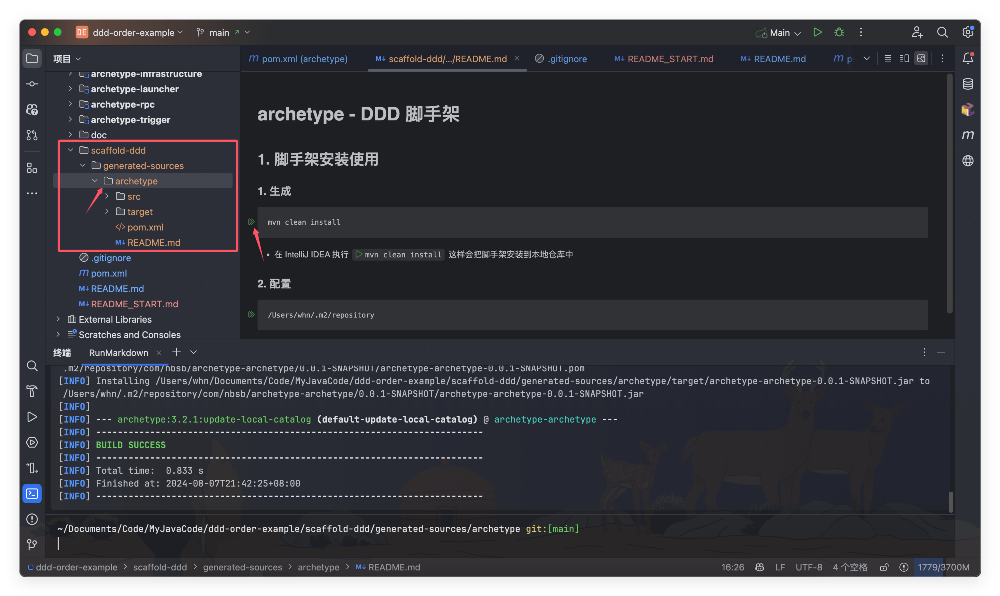

<h1 align="center" style="margin: 30px 0 30px; font-weight: bold;">DDD+CQRS脚手架</h1>
<h4 align="center">快速创建DDD+CQRS脚手架</h4>

##  🐻‍❄️ 介绍

在平时写项目时每个项目都需要新建很多包，有时候一个项目还没开始写光说创建几个模块和基础模块文件都要很长时间，为此写了一个脚手架方便创建项目使用，当然如果你对这个不满意可以`fork`到自己仓库下根据自己需求进行更改，或者提供`Issue`

## 🕊️ 快速开始

## 1.框架安装

- 进入工程脚手架模块下的 README.md 点击执行 mvn clean install

## 2.配置

配置自己的maven的路径

这一步注意尽管和上面的是自己默认的仓库但是也要创建一下，不然可能会识别不到

- 首先是点击创建工程，之后进入 Maven Archetype 下。
- 之后你需要自己配置好 maven 工程脚手架地址，有可能默认的路径地址，不生效。

## 3.使用

选择刚刚添加的脚手架

- 进入 Maven Archetype 如图方式创建工程。

## 4.效果

- 此时代码已经自动化生成完毕，如果创建失败可以检查第2步的Maven的路径

## 👨🏻‍💻 编译项目

如果先基于此项目进行完善出自己的脚手架可以看： [编译项目](README_COMPILE.md) 

## ⚡ 反馈与交流

有问题可以联系作者，有其他的想法或者有问题都可以联系作者或提Issue。你也可以在Issue查看别人提的问题和给出解决方案

作者qq：3500079813

作者微信：扫码加好友拉你进交流群

