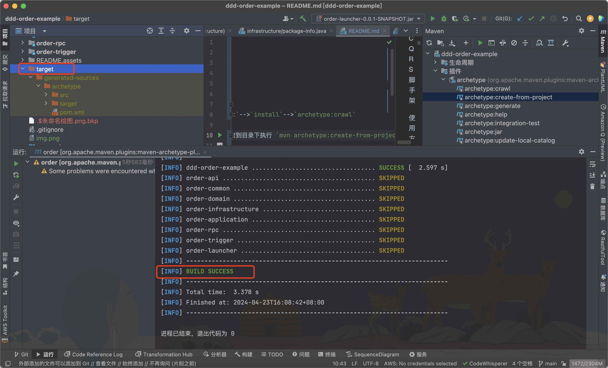

<h1 align="center" style="margin: 30px 0 30px; font-weight: bold;">DDD+CQRS脚手架</h1>
<h4 align="center">快速创建DDD+CQRS脚手架</h4>

##  🐻‍❄️ 介绍

在平时写项目时每个项目都需要新建很多包，有时候一个项目还没开始写光说创建几个模块和基础模块文件都要很长时间，为此写了一个脚手架方便创建项目使用，当然如果你对这个不满意可以`fork`到自己仓库下根据自己需求进行更改，或者提供`Issue`


## 🕊️ 快速开始

3步完成DDD+CQRS脚手架的使用

克隆项目-->`archetype:create-from-project`-->`install`-->`archetype:crawl`

#### 1.安装到本地

点击 `archetype:create-from-project` 或者到目录下执行 `mvn archetype:create-from-project`


成功执行,并且左侧生成的target文件夹



#### 2.到`target/generated-sources/archetype`文件夹下

执行`mvn clean install` 


执行`mvn archetype:crawl`


可以看到你的maven的repository文件夹下生成了这个pom文件


打开这个pom文件可以看到如下内容

```opm
<?xml version="1.0" encoding="UTF-8"?>
<archetype-catalog xsi:schemaLocation="http://maven.apache.org/plugins/maven-archetype-plugin/archetype-catalog/1.0.0 http://maven.apache.org/xsd/archetype-catalog-1.0.0.xsd"
    xmlns="http://maven.apache.org/plugins/maven-archetype-plugin/archetype-catalog/1.0.0"
    xmlns:xsi="http://www.w3.org/2001/XMLSchema-instance">
  <archetypes>
    <archetype>
      <groupId>com.nbsb</groupId>
      <artifactId>order-archetype</artifactId>
      <version>0.0.1-SNAPSHOT</version>
      <description>order</description>
    </archetype>
    <archetype>
      <groupId>com.nbsb</groupId>
      <artifactId>ddd-order-example-archetype</artifactId>
      <version>0.0.1-SNAPSHOT</version>
      <description>ddd-order-example</description>
    </archetype>
  </archetypes>
</archetype-catalog>

```

#### 3.创建项目

创建maven项目


## ⚡ 反馈与交流

有问题可以联系作者，有其他的想法或者有问题都可以联系作者或提Issue。你也可以在Issue查看别人提的问题和给出解决方案

作者qq：3500079813

作者微信：扫码加好友拉你进交流群


