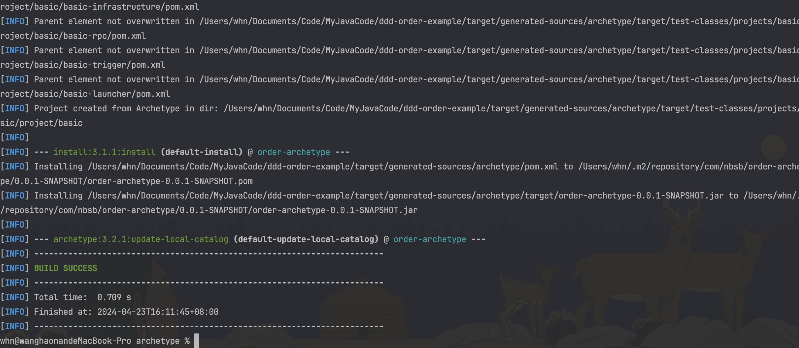
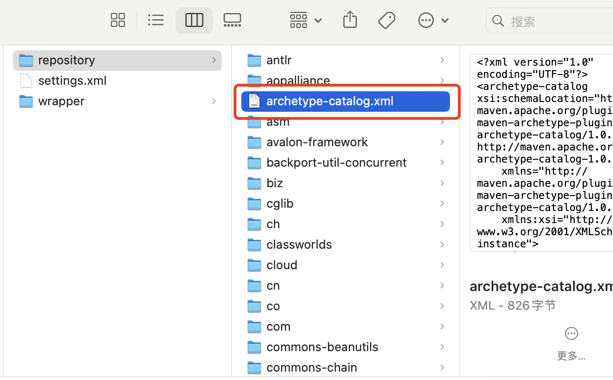
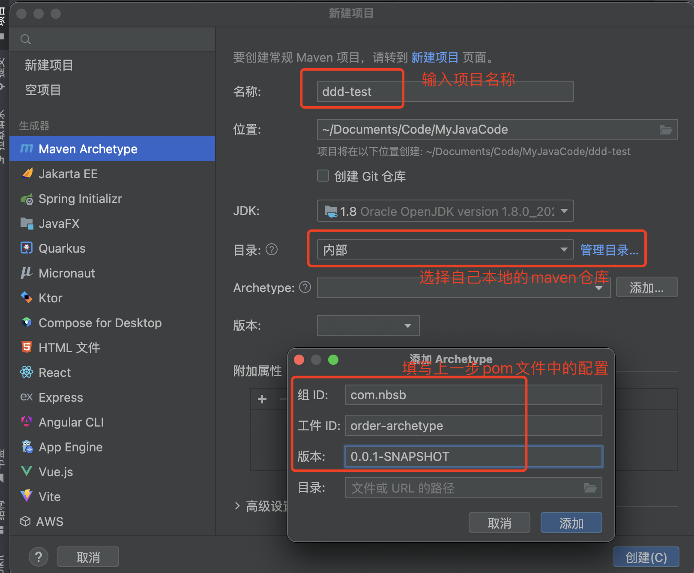
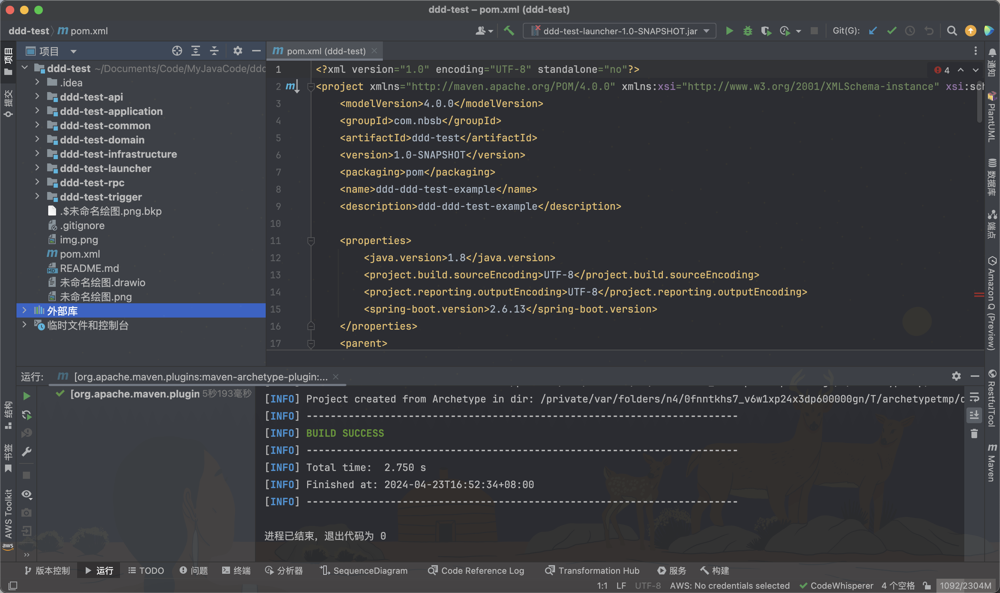

克隆项目-->`archetype:create-from-project`-->`install`-->`archetype:crawl`

#### 1.安装到本地

点击 `archetype:create-from-project` 或者到目录下执行 `mvn archetype:create-from-project`


成功执行,并且左侧生成的target文件夹


#### 2.到`target/generated-sources/archetype`文件夹下

执行`mvn clean install` 



执行`mvn archetype:crawl`


可以看到你的maven的repository文件夹下生成了这个pom文件




打开这个pom文件可以看到如下内容

```opm
<?xml version="1.0" encoding="UTF-8"?>
<archetype-catalog xsi:schemaLocation="http://maven.apache.org/plugins/maven-archetype-plugin/archetype-catalog/1.0.0 http://maven.apache.org/xsd/archetype-catalog-1.0.0.xsd"
    xmlns="http://maven.apache.org/plugins/maven-archetype-plugin/archetype-catalog/1.0.0"
    xmlns:xsi="http://www.w3.org/2001/XMLSchema-instance">
  <archetypes>
    <archetype>
      <groupId>com.nbsb</groupId>
      <artifactId>order-archetype</artifactId>
      <version>0.0.1-SNAPSHOT</version>
      <description>order</description>
    </archetype>
    <archetype>
      <groupId>com.nbsb</groupId>
      <artifactId>ddd-order-example-archetype</artifactId>
      <version>0.0.1-SNAPSHOT</version>
      <description>ddd-order-example</description>
    </archetype>
  </archetypes>
</archetype-catalog>

```

#### 3.创建项目

创建maven项目



等待几秒后就完整的生成了项目文件夹了，只需要刷新maven加载依赖就可以正常的进行写业务代码了


