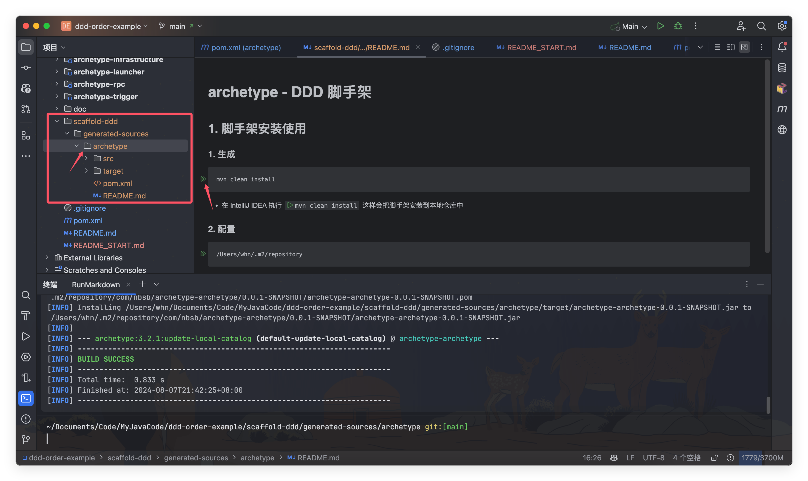
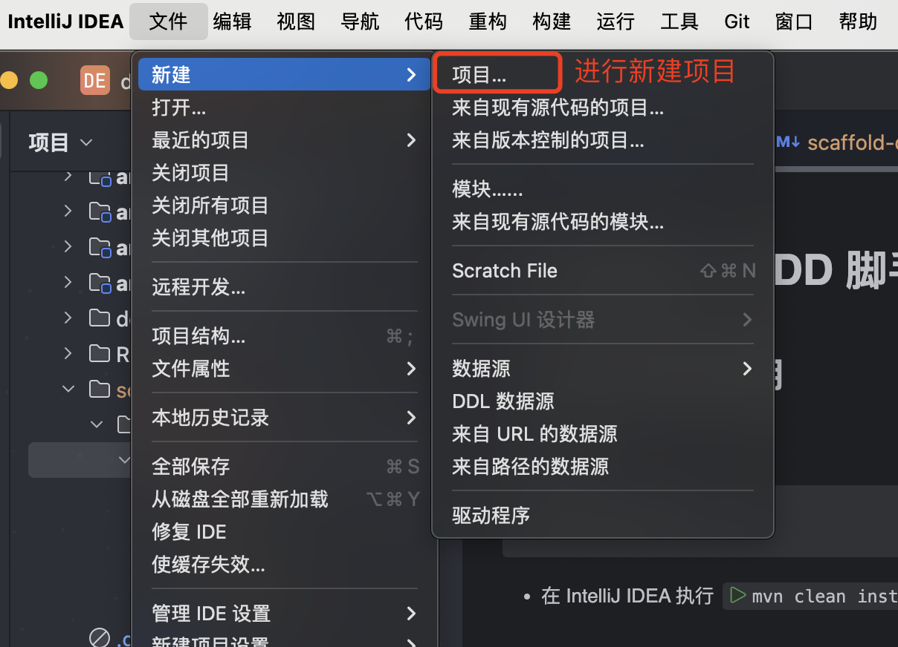
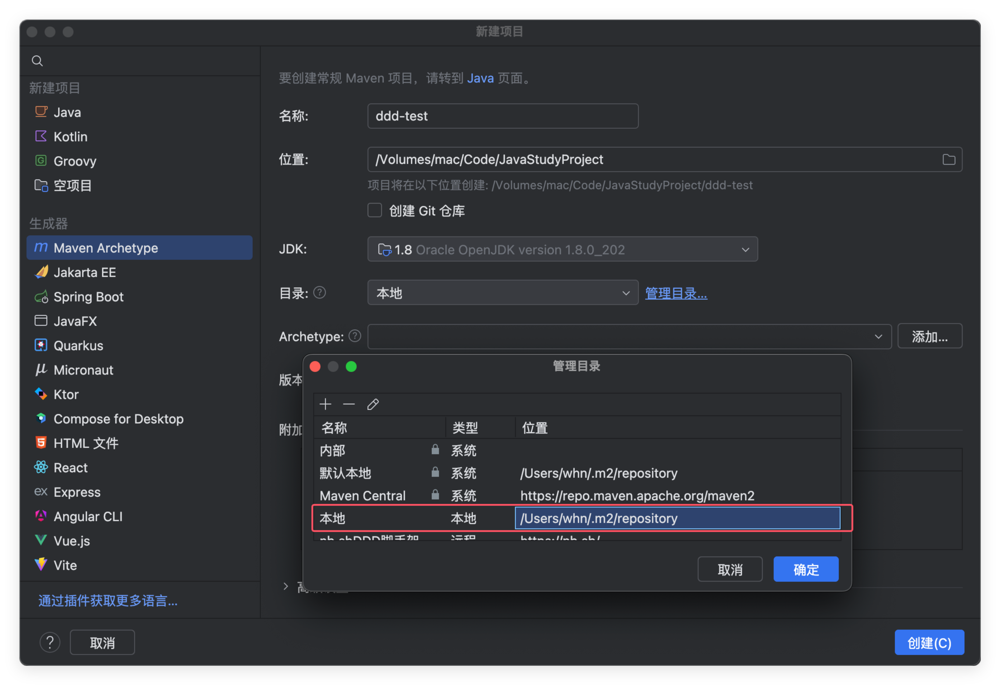
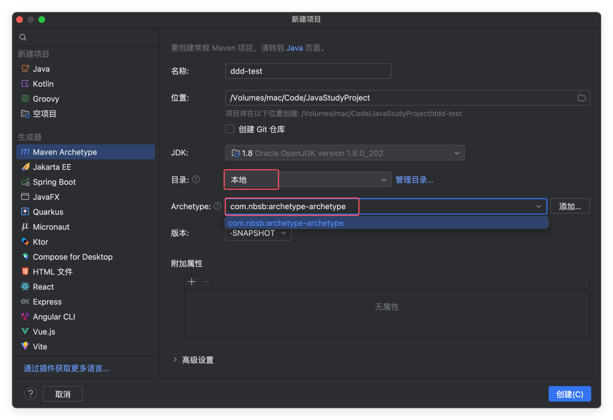
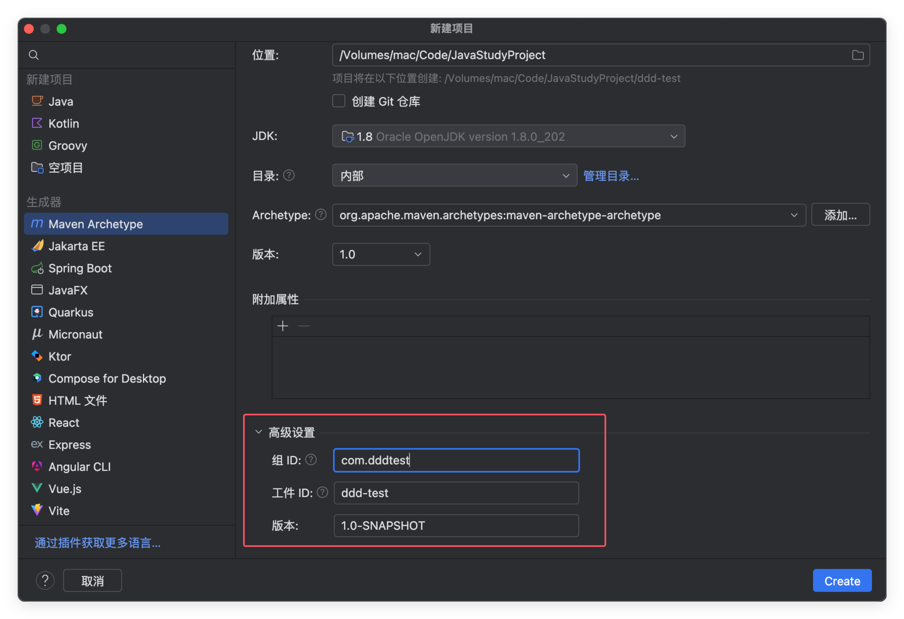
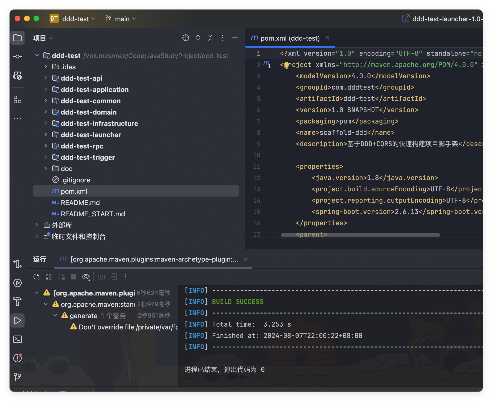

## 1.框架安装

- 进入工程脚手架模块下的 README.md 点击执行 mvn clean install

## 2.配置

配置自己的maven的路径

这一步注意尽管和上面的是自己默认的仓库但是也要创建一下，不然可能会识别不到

- 首先是点击创建工程，之后进入 Maven Archetype 下。
- 之后你需要自己配置好 maven 工程脚手架地址，有可能默认的路径地址，不生效。

## 3.使用

选择刚刚添加的脚手架

- 进入 Maven Archetype 如图方式创建工程。

## 4.效果

- 此时代码已经自动化生成完毕，如果创建失败可以检查第2步的Maven的路径
- 自动生成工程，之后你就可以通过 docs 文件夹下的 docker-compose.yml 安装环境并使用了。**注意本机已安装了 Docker**
